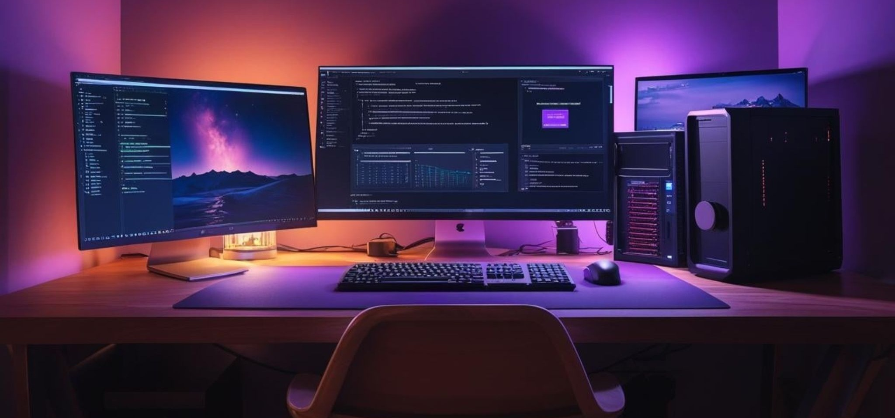

<h2 align="center">Hi 👋! This is Fabiha</h2>
<h2 align="center">A Passionate Web Developer from Bangladesh</h2>

 
<h2>👩‍💻 About Me</h2>

I’m a MERN Stack Developer passionate about smooth, interactive web experiences.

I love working with React and GSAP to bring UIs to life.

Currently learning Next.js and Typescript and improving my backend skills.

Always curious and excited to explore new tools and technologies also 3D tools.

<!--
**fabiha23/fabiha23** is a ✨ _special_ ✨ repository because its `README.md` (this file) appears on your GitHub profile.

Here are some ideas to get you started:

- 🔭 I’m currently working on ...
- 🌱 I’m currently learning ...
- 👯 I’m looking to collaborate on ...
- 🤔 I’m looking for help with ...
- 💬 Ask me about ...
- 📫 How to reach me: ...
- 😄 Pronouns: ...
- ⚡ Fun fact: ...
-->
